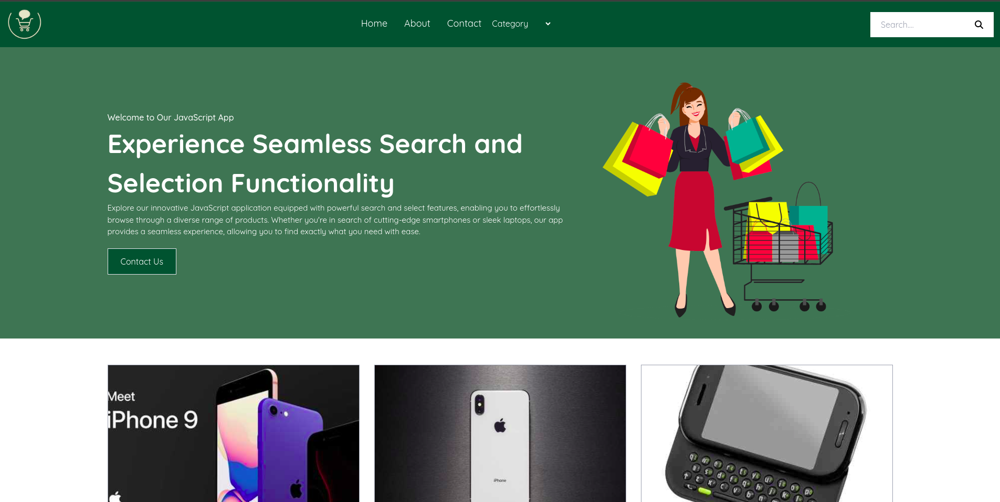

# EasyShop

## Description
EasyShop is a JavaScript project designed for managing and displaying products efficiently. It features a responsive design and utilizes Tailwind CSS for styling. The project incorporates functionalities such as search and selection to enhance user experience.

## Live Demo
- **[View Live Demo](https://dharam-in.github.io/EasyShop/)**

## Features
- **Product Management:** Easily manage and display products using arrays and nested arrays.
- **Search Functionality:** Users can search for specific products within the inventory.
- **Select Functionality:** Ability to select and interact with individual products.
- **Responsive Design:** The project is built to be fully responsive, ensuring a seamless experience across various devices.

## Technologies Used
- **JavaScript:** Used for project logic and functionality implementation.
- **Tailwind CSS:** Utilized for styling and creating a visually appealing user interface.
- **HTML:** Used for structuring the web page.
- **CSS:** Minimal CSS for additional styling if needed.

## Screenshot

## Usage
1. Browse through the products displayed on the page.
2. Utilize the search functionality to find specific products.
3. Interact with individual products using the select functionality.

## How to Run
1. Clone this repository to your local machine.
2. Open the `index.html` file in a web browser.

## Credits
- Project developed by [Dharam-IN]
- Tailwind CSS: A utility-first CSS framework for rapid UI development.
- Any additional resources used in the project.

Feel free to customize this readme file further according to your project's specifics and preferences.
